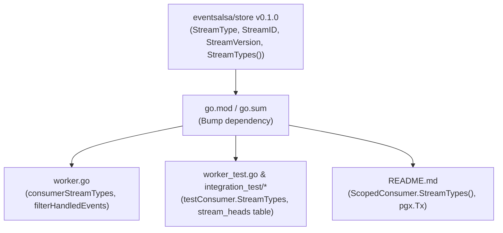

# Implementation Plan: Upgrade to `eventsalsa/store` v0.1.0 & Stream Terminology Migration

Upgrade `github.com/eventsalsa/store` from `v0.0.3` to `v0.1.0` in `eventsalsa/worker`, align all terminology from `Aggregate`/`aggregate` to `Stream`/`stream` across consumer interfaces, event filtering, tests, and documentation, and prepare the repository for the `v0.1.0` release.

---

## User Review Required

> [!IMPORTANT]
> - **Pre-Major Minor Bump Configuration**: `"bump-minor-pre-major": true` is already present in [`release-please-config.json`](release-please-config.json#L8).
> - **Breaking Commit Format**: The resulting commit will use the breaking change syntax (`refactor(worker)!: ...`) and include `BREAKING CHANGE: ...` in the footer to ensure Release Please cuts `v0.1.0` instead of a major release (`v1.0.0`) or a patch release (`v0.0.4`).
> - **Git Branching Strategy**: A feature branch `refactor/store-v0.1.0-stream-migration` will be created off `main` to perform the changes, adhering to the repository conventions.

---

## Proposed Changes



---

### Dependency Management

#### [MODIFY] [`go.mod`](go.mod) & [`go.sum`](go.sum)
- Update `github.com/eventsalsa/store` requirement from `v0.0.3` to `v0.1.0`.
- Run `go mod tidy`.

---

### Core Worker Engine

#### [MODIFY] [`worker.go`](worker.go)
- Rename helper `consumerAggregateTypes` to `consumerStreamTypes`.
- Update `consumerStreamTypes` to call `scopedConsumer.StreamTypes()` instead of `scopedConsumer.AggregateTypes()`.
- Update `filterHandledEvents`:
  - Rename parameter `aggregateTypes []string` to `streamTypes []string`.
  - Update filtering loop to check `rows[i].StreamType` against allowed stream types instead of `rows[i].AggregateType`.
- Update caller in [`scanEventsForConsumerBatch`](worker.go#L972) to invoke `consumerStreamTypes(registeredConsumer)`.

---

### Unit & Integration Tests

#### [MODIFY] [`worker_test.go`](worker_test.go)
- Update `scopedRecordingConsumer`:
  - Rename field `aggregateTypes []string` to `streamTypes []string`.
  - Update interface method from `AggregateTypes() []string` to `StreamTypes() []string`.
- Update test fixture helper `makeEvent`:
  - Change `AggregateType`, `AggregateID`, `AggregateVersion` to `StreamType`, `StreamID`, `StreamVersion`.
- Update test assertions checking `handled[0].AggregateType` to `handled[0].StreamType`.

#### [MODIFY] [`integration_test/helpers_test.go`](integration_test/helpers_test.go)
- Update `testEventBatch`: replace `AggregateType` and `AggregateID` fields with `StreamType` and `StreamID`.
- Update `testConsumer`: replace `aggregateTypes` field and `AggregateTypes()` method with `streamTypes` and `StreamTypes()`.
- Update `testHandledEvent`: replace `AggregateType` and `AggregateID` fields with `StreamType` and `StreamID`.
- Update SQL setup / cleanup:
  - Change `DROP TABLE IF EXISTS aggregate_heads CASCADE;` to `DROP TABLE IF EXISTS stream_heads CASCADE;`.
  - Update `TRUNCATE TABLE ... aggregate_heads ...` to `stream_heads`.
  - Update `test_consumer_events` table schema columns from `aggregate_type`, `aggregate_id` to `stream_type`, `stream_id`.
  - Update `queryHandledEvents` query and scan targets to `stream_type`, `stream_id`.
- Update `generateStoreSQL`: change `AggregateHeadsTable: "aggregate_heads"` to `StreamHeadsTable: "stream_heads"` in `storemigrations.Config`.
- Update `appendTestEvents` and `beginControlledAppend` helpers to use `StreamType` and `StreamID`.

#### [MODIFY] [`integration_test/scaling_test.go`](integration_test/scaling_test.go)
- Rename parameter `aggregateType` to `streamType` in `runProcessingStep`.

#### [MODIFY] [`integration_test/worker_test.go`](integration_test/worker_test.go)
- Update all `testEventBatch` struct literals from `AggregateType: ...` to `StreamType: ...`.

---

### Documentation & Release Configuration

#### [MODIFY] [`README.md`](README.md)
- Update code snippets:
  - Change `(p *AccountProjection) AggregateTypes() []string` to `(p *AccountProjection) StreamTypes() []string`.
  - Change `ScopedConsumer` interface snippet from `AggregateTypes() []string` to `StreamTypes() []string`.
  - Update `Handle` method signatures in README examples to use `tx pgx.Tx` instead of `tx *sql.Tx` to stay aligned with `store/consumer` contracts.

#### [VERIFY] [`release-please-config.json`](release-please-config.json)
- Confirm `"bump-minor-pre-major": true` is configured.

---

## Verification Plan

### Automated Tests
Run the following verification commands using `rtk` (per repository rules):

1. **Format and Lint Check**:
   ```bash
   rtk make fmt
   rtk make lint
   ```
2. **Unit Tests**:
   ```bash
   rtk make test-unit
   ```
3. **Integration Tests (PostgreSQL via testcontainers-go)**:
   ```bash
   rtk make test-integration
   ```
4. **Full Verification**:
   ```bash
   rtk make check
   ```

### Manual Verification
- Verify that `rtk git status` and `rtk git diff` cleanly show the terminology migration with zero remaining references to `Aggregate`/`aggregate` in non-historical files.
- Verify that the commit message contains the `!` breaking change indicator and a descriptive body.
