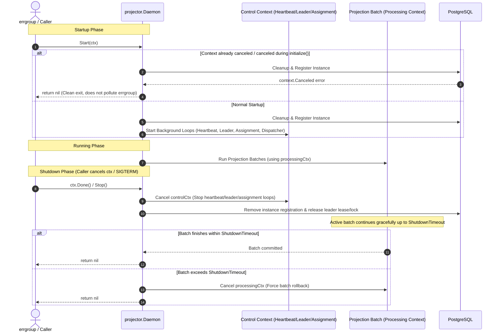

# Implementation Plan - `projector.Daemon` Lifecycle Improvements for Flawless `errgroup` Integration

This plan details the architectural and lifecycle refinements to make [`*projector.Daemon`](daemon.go#L70-L89) a seamless, robust citizen in standard Go concurrency patterns (especially `golang.org/x/sync/errgroup` and OS signal / Kubernetes pod supervision).

---

## Goal Description

When running multiple [`Daemon`](daemon.go#L70-L89) instances within an application worker using `errgroup.WithContext(ctx)`, the daemon must cleanly adhere to the standard `errgroup` contract:
1. **Clean Shutdown:** Return `nil` when the context is canceled (both during steady-state processing and during initial registration/startup).
2. **Deterministic Shutdown Budget:** Allow configuring the shutdown grace period (`WithShutdownTimeout`) to align with container orchestrator termination grace periods (e.g. Kubernetes `terminationGracePeriodSeconds`).
3. **Graceful Batch Draining:** Ensure active projection batches are given a graceful draining window during shutdown before forced cancellation, reconnecting the intended two-stage shutdown flow.
4. **State Inspection for Health Probes:** Export `IsRunning()` and `IsLeader()` to allow HTTP health/readiness probes (`/healthz`, `/readyz`) to query daemon status in worker processes.

---

## Architecture & Lifecycle Flow



---

## Proposed Changes

### Component: Core Configuration (`config.go`, `config_test.go`)

#### [MODIFY] [`config.go`](config.go)
- Add `ShutdownTimeout time.Duration` field to [`Config`](config.go#L32-L56).
- Set `ShutdownTimeout: 5 * time.Second` in [`DefaultConfig()`](config.go#L63-L87).
- Add option constructor [`WithShutdownTimeout(d time.Duration) Option`](config.go).
- Update [`applyOptions()`](daemon.go#L1484-L1558) to normalize `ShutdownTimeout` if $\le 0$.

```go
// WithShutdownTimeout sets the maximum duration to wait for graceful daemon shutdown.
func WithShutdownTimeout(d time.Duration) Option {
	return func(c *Config) {
		c.ShutdownTimeout = d
	}
}
```

#### [MODIFY] [`config_test.go`](config_test.go)
- Update `TestDefaultConfig`, `TestApplyOptionsComposesMultipleOptions`, `TestOptionFunctions`, and `TestApplyOptionsNormalizesInvalidValues` to assert `ShutdownTimeout`.

---

### Component: Daemon Engine & Lifecycle (`daemon.go`, `daemon_test.go`)

#### [MODIFY] [`daemon.go`](daemon.go)

1. **Context cancellation during `initialize()`:**
   Update [`Start`](daemon.go#L155-L157) so that if `d.initialize` fails due to context cancellation, `Start` cleanly returns `nil`:
   ```go
   if err := d.initialize(controlCtx, &registered); err != nil {
       if controlCtx.Err() != nil && errors.Is(err, context.Canceled) {
           return nil
       }
       return err
   }
   ```

2. **Configurable Shutdown Timeout:**
   Add `shutdownTimeout()` helper using `d.config.ShutdownTimeout` (defaulting to 5s if unset), and replace references to `defaultShutdownTimeout` inside [`shutdown()`](daemon.go#L217-L256).

3. **Graceful Batch Draining via `processingCtx`:**
   In [`runProjection`](daemon.go#L683-L685), replace the discarded second parameter `_` with `processingCtx context.Context`, and pass `processingCtx` to `processBatchWithGapState`:
   ```go
   func (d *Daemon) runProjection(
       controlCtx, processingCtx, assignmentCtx context.Context,
       registeredProjection Projection,
   ) {
       ...
       result, err := d.processBatchWithGapState(processingCtx, registeredProjection, gapTracker)
   ```
   This ensures active batches are not abruptly canceled when `controlCtx` is canceled, but are granted up to `shutdownTimeout` to complete their in-flight transaction before `processingCancel()` is invoked.

4. **Export State Inspection Methods:**
   Export [`IsRunning() bool`](daemon.go) and [`IsLeader() bool`](daemon.go):
   ```go
   // IsRunning returns true if the daemon is currently started and running.
   func (d *Daemon) IsRunning() bool {
       d.mu.Lock()
       defer d.mu.Unlock()
       return d.started
   }

   // IsLeader returns true if this instance currently holds the leader role.
   func (d *Daemon) IsLeader() bool {
       return d.leaderActive()
   }
   ```

---

## Verification Plan

### Automated Tests
Run unit and race detection tests:
```bash
go test -v -race ./...
```
Run linter:
```bash
golangci-lint run --timeout=5m
```
Run full check suite (unit tests, integration tests with testcontainers, linter):
```bash
rtk make check
```

### New Unit Tests to Add in `daemon_test.go`:
1. `TestDaemon_Start_CanceledContextReturnsNil`: Tests calling `d.Start(canceledCtx)` returns `nil` and doesn't fail with wrapped `context.Canceled`.
2. `TestDaemon_IsRunning_StateTransitions`: Tests `IsRunning()` transitions from `false` -> `true` -> `false`.
3. `TestDaemon_IsLeader_Default`: Tests `IsLeader()` returns false initially and reflects leadership state.
4. `TestDaemon_ShutdownTimeout_Configured`: Tests custom `WithShutdownTimeout` is honored during shutdown.
