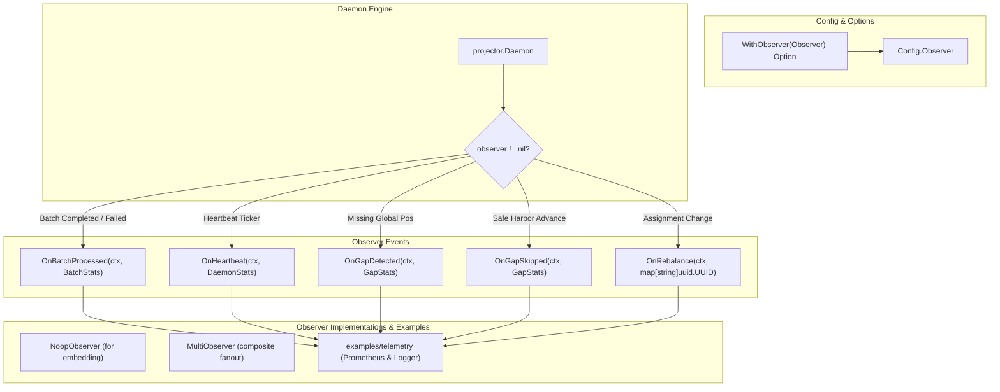

# Implementation Plan - Pluggable Observer (Metrics & Lifecycle Telemetry) for `eventsalsa/projector`

## Goal Description
Introduce a pluggable `Observer` interface into `eventsalsa/projector` configured via `projector.WithObserver(observer Observer)`. This allows applications to capture real-time projection metrics (batch latency, global lag, throughput, error tracking) and daemon lifecycle events (heartbeats, leadership state, gap detection, safe-harbor stale gap skips, and partition rebalances) without running redundant out-of-band polling queries against PostgreSQL.

The design adheres to:
1. **Zero Allocations & Zero Overhead when Disabled**: Call-site nil guards avoid struct creation, clock reads, slice copies, and interface dispatch when no observer is configured.
2. **Zero-Dependency Core**: The core module remains 100% free of external metric libraries (Prometheus/OpenTelemetry).
3. **Accurate Global Lag**: Positions and lag are tracked in terms of monotonic `global_position`, consistent with the event store and checkpoint table semantics.
4. **Comprehensive Documentation & Examples**: Full README coverage with metric recipes, plus a runnable `examples/telemetry/` sample showcasing Prometheus/OTel/logging adapters.
5. **Rigorous & Fanatical Testing**: Exhaustive unit tests and integration tests with real PostgreSQL containers covering every hook, lifecycle state, error condition, and edge case.

---

## User Review Required

> [!IMPORTANT]
> **API Stability & Compatibility**: All proposed additions are strictly backwards-compatible. Default behavior without `WithObserver` is unchanged and incurs zero performance penalty.

> [!NOTE]
> **Lag Metric Semantics**: `Lag` in `BatchStats` is computed as `max(0, HeadPosition - LastPosition)` where positions are monotonic global sequence numbers. Both the precomputed `Lag` and the raw coordinates (`StartPosition`, `LastPosition`, `HeadPosition`) are exposed for maximum flexibility across telemetry backends.

---

## Proposed Changes



---

### Core Package: Observer Definitions & Utilities

#### [NEW] `observer.go`
Defines the `Observer` interface, data structures, `NoopObserver`, and `MultiObserver`:

```go
package projector

import (
	"context"
	"time"

	"github.com/google/uuid"
)

// BatchStats contains execution telemetry for a single projection batch.
type BatchStats struct {
	ProjectionName string
	StartPosition  int64         // Checkpoint position prior to batch execution
	LastPosition   int64         // Checkpoint position after batch execution
	HeadPosition   int64         // Highest visible/known global position
	Lag            int64         // Global event lag: max(0, HeadPosition - LastPosition)
	EventsRead     int           // Total events read in the batch window
	EventsHandled  int           // Total events successfully processed by projection
	Duration       time.Duration // Total batch duration (fetch + handle + checkpoint commit)
	StaleSkipped   bool          // True if safe-harbor advanced past an unresolvable stale gap
	Error          error         // Non-nil if batch execution failed
}

// DaemonStats contains instance-level lifecycle telemetry.
type DaemonStats struct {
	InstanceID uuid.UUID
	IsLeader   bool
}

// GapStats contains details when a projection encounters a missing sequence position.
type GapStats struct {
	ProjectionName string
	GapPosition    int64
	HighestVisible int64
	StaleFor       time.Duration
}

// Observer receives real-time telemetry and lifecycle events from the projector daemon.
// All implementations must be safe for concurrent execution across multiple goroutines.
type Observer interface {
	// OnBatchProcessed is called after every batch processing attempt (success or error).
	OnBatchProcessed(ctx context.Context, stats BatchStats)

	// OnHeartbeat is called after each successful heartbeat refresh.
	OnHeartbeat(ctx context.Context, stats DaemonStats)

	// OnGapDetected is called when a projection is blocked by a missing global sequence position.
	OnGapDetected(ctx context.Context, stats GapStats)

	// OnGapSkipped is called when safe-harbor advancement skips an unresolvable stale gap.
	OnGapSkipped(ctx context.Context, stats GapStats)

	// OnRebalance is called when projection partition assignments are updated.
	OnRebalance(ctx context.Context, assignments map[string]uuid.UUID)
}

// NoopObserver provides empty implementations of all Observer methods.
// Embed NoopObserver into custom structs to implement only the desired callbacks.
type NoopObserver struct{}

func (NoopObserver) OnBatchProcessed(context.Context, BatchStats)                      {}
func (NoopObserver) OnHeartbeat(context.Context, DaemonStats)                          {}
func (NoopObserver) OnGapDetected(context.Context, GapStats)                           {}
func (NoopObserver) OnGapSkipped(context.Context, GapStats)                            {}
func (NoopObserver) OnRebalance(context.Context, map[string]uuid.UUID)                 {}

// MultiObserver combines multiple Observers into a single composite Observer.
// Nil observers are stripped and nested MultiObservers are flattened.
func MultiObserver(observers ...Observer) Observer { ... }
```

#### [NEW] `observer_test.go`
Unit tests verifying:
- `NoopObserver` completeness and safe embedding.
- `MultiObserver` normalization (stripping nil, flattening nested multi-observers, handling empty input).
- `MultiObserver` fan-out correctness across all methods.

---

### Configuration & Daemon Instrumentation

#### [MODIFY] `config.go`
- Add `Observer Observer` field to `Config`.
- Add `WithObserver(observer Observer) Option`.
- Update `DefaultConfig()` with `Observer: nil`.

#### [MODIFY] `config_test.go`
- Test `WithObserver` option application.
- Test `applyOptions` normalization and nil-safety with observer options.

#### [MODIFY] `daemon.go`
- Instrument `runHeartbeatLoop` to trigger `d.observer.OnHeartbeat(ctx, DaemonStats{...})`.
- Instrument `probeFrontier` to trigger `d.observer.OnGapDetected(ctx, GapStats{...})` when blocked by gap.
- Instrument `processBatchWithGapState` / `processProbedBatchAttempt`:
  - Record batch start time `start := timeNow()`.
  - Measure execution latency and calculate `BatchStats` (start position, last position, head position, lag, events read, events handled, stale skipped).
  - Trigger `d.observer.OnBatchProcessed(ctx, stats)` for both successful commits and errors.
  - Trigger `d.observer.OnGapSkipped(ctx, GapStats{...})` when `result.staleSkipped == true`.
- Instrument `rebalance` to trigger `d.observer.OnRebalance(ctx, nextAssignments)` after assignment commit.

---

### Documentation & Runnable Examples

#### [MODIFY] `README.md`
- Add **Observability & Telemetry** section detailing:
  - The `Observer` interface architecture and zero database query overhead.
  - Explanation of `BatchStats`, `DaemonStats`, `GapStats`.
  - Standard Prometheus metric naming recommendations:
    - `projector_batch_duration_seconds` (Histogram)
    - `projector_lag_events` (Gauge)
    - `projector_checkpoint_position` (Gauge)
    - `projector_events_processed_total` (Counter)
    - `projector_leader_status` (Gauge)
    - `projector_gap_skips_total` (Counter)
  - Ready-to-use Prometheus adapter recipe.
  - Ready-to-use OpenTelemetry trace/metric recipe.
  - Update options table with `WithObserver(observer)`.

#### [NEW] `examples/telemetry/main.go`
A clean, runnable example demonstrating:
- Custom logging observer with structured logging.
- Metrics observer adapter.
- Combining them using `projector.MultiObserver`.
- Wiring to `projector.New(...)` with `projector.WithObserver(...)`.

---

### Unit & Integration Test Suites

#### [MODIFY] `daemon_test.go`
Add rigorous unit tests using `stubDBState` and `stubProjectorStore`:
1. `TestObserver_NilSafety_ZeroAllocations`: Verify that daemon operations run identically when `Observer` is `nil`.
2. `TestObserver_OnBatchProcessed_Success`: Verify exact `BatchStats` (start/end positions, head position, lag calculation, events read/handled, duration > 0, error == nil).
3. `TestObserver_OnBatchProcessed_FilteredProjections`: Verify `EventsRead` vs `EventsHandled` when stream-type/event-type filters skip subset of events.
4. `TestObserver_OnBatchProcessed_HandlerError`: Verify `BatchStats` on handler failure (non-nil `Error`, `EventsHandled` reflects failure index, checkpoint unadvanced).
5. `TestObserver_OnBatchProcessed_DatabaseError`: Verify `BatchStats` on DB `BeginTx` or `Commit` failure.
6. `TestObserver_OnGapDetected`: Verify `GapStats` when a missing sequence number blocks progress.
7. `TestObserver_OnGapSkipped`: Verify `GapStats` and `BatchStats.StaleSkipped == true` when safe harbor advances past stale gap.
8. `TestObserver_OnHeartbeat`: Verify `DaemonStats` emitted on heartbeat ticker with accurate `InstanceID` and `IsLeader`.
9. `TestObserver_OnRebalance`: Verify `OnRebalance` emitted on partition distribution.

#### [NEW] `integration_test/observer_test.go`
Add exhaustive end-to-end integration tests running against PostgreSQL via testcontainers:
1. `TestIntegration_Observer_FullLifecycle`:
   - Start daemon with mock observer.
   - Append events across multiple streams.
   - Verify `OnHeartbeat`, `OnRebalance`, and `OnBatchProcessed` fire with accurate live database coordinates.
2. `TestIntegration_Observer_BacklogCatchupLag`:
   - Seed 100 events prior to daemon startup.
   - Set `BatchSize(20)`.
   - Assert observer captures monotonic lag decrease across 5 consecutive batches until `Lag == 0`.
3. `TestIntegration_Observer_GapDetectionAndStaleSkip`:
   - Use `beginControlledAppend` to hold an uncommitted transaction.
   - Append subsequent events.
   - Assert observer captures `OnGapDetected`.
   - Wait for `StaleGapThreshold`.
   - Assert observer captures `OnGapSkipped` and `BatchStats{StaleSkipped: true}`.
4. `TestIntegration_Observer_MultiProjectorRebalanceAndFailover`:
   - Start 2 daemons with distinct observers.
   - Assert leader observer receives `OnRebalance` with 50/50 partition split.
   - Stop daemon 1.
   - Assert survivor observer receives `OnRebalance` with 100% partitions and `OnHeartbeat` with `IsLeader: true`.
5. `TestIntegration_Observer_BatchFailureAndRetry`:
   - Configure projection with intermittent failure on a specific global position.
   - Assert observer captures initial batch failure with `Error != nil`.
   - Clear failure and assert subsequent retry batch succeeds with `Error == nil`.

---

## Verification Plan

### Automated Tests
Run the complete test suite including linter, unit tests with race detector, integration tests, and example build check:

```bash
# 1. Format & Lint
rtk make fmt
rtk make lint

# 2. Run Unit Tests (race detector + coverage)
rtk make test-unit

# 3. Run Postgres Integration Tests (testcontainers)
rtk make test-integration

# 4. Verify Examples Build
go build -v ./examples/...

# 5. Full Verification Suite
rtk make check
```

### Manual / Edge Case Verification
- Verify zero allocations in benchmarks / nil-observer path.
- Verify `MultiObserver` behavior under concurrent callbacks.
- Verify that `Lag` never underflows or produces negative numbers under edge-case position overrides.
